  <picture>
    <source media="(prefers-color-scheme: dark)" srcset="assets/header-dark.svg">
    
  </picture>

 

I build **Vedetta**, compliance software for Monaco's regulated professions: client files, sanctions and PEP screening, document reading, risk assessment and reports, with client data hosted in Monaco.

I study banking at the International University of Monaco (BBA, Banking & Financial Services). I also spent a year in private banking in Monaco, on KYC and client onboarding, which is where Vedetta comes from.

### How I got here

I started at 16, during lockdown, running *Modern Roleplay*, one of the largest GTA V roleplay servers in France, with 400+ players online at once. I led the development team and the in-game staff and learned production the hard way: Linux, networking, DDoS filtering, uptime at 2 a.m. That became Modern Labs, then Blaze.

## Now building

  <picture>
    <source media="(prefers-color-scheme: dark)" srcset="assets/card-vedetta-dark.svg">
    
  </picture>
  <picture>
    <source media="(prefers-color-scheme: dark)" srcset="assets/card-lists-dark.svg">
    
  </picture>
  <picture>
    <source media="(prefers-color-scheme: dark)" srcset="assets/card-pro-dark.svg">
    
  </picture>

## Stack

  <picture>
    <source media="(prefers-color-scheme: dark)" srcset="assets/stack-dark.svg">
    
  </picture>

## Activity

  <picture>
    <source media="(prefers-color-scheme: dark)" srcset="https://github-readme-stats.vercel.app/api?username=BlazeMonk&show_icons=true&count_private=true&include_all_commits=true&hide_border=true&title_color=F2EFE8&text_color=B0ABA1&icon_color=1E7EC8&bg_color=0B2336">
    
  </picture>
  <picture>
    <source media="(prefers-color-scheme: dark)" srcset="https://streak-stats.demolab.com?user=BlazeMonk&hide_border=true&background=0B2336&ring=1E7EC8&fire=1E7EC8&currStreakNum=F2EFE8&sideNum=F2EFE8&currStreakLabel=F2EFE8&sideLabels=B0ABA1&dates=A3AAAB">
    
  </picture>

  <picture>
    <source media="(prefers-color-scheme: dark)" srcset="https://activity-graph.vercel.app/graph?username=BlazeMonk&bg_color=0B2336&color=F2EFE8&line=1E7EC8&point=F2EFE8&area=true&area_color=154A73&hide_border=true&custom_title=Contributions">
    
  </picture>

---

**How I work:** tested before merged, monitored in production, data where the client expects it.

Most of my work is private. Public: [QuickMail](https://github.com/BlazeMonk/quickmail), a self-hosted web mail client on Cloudflare Workers.

<!-- Contact: add an email address here if wanted. -->
